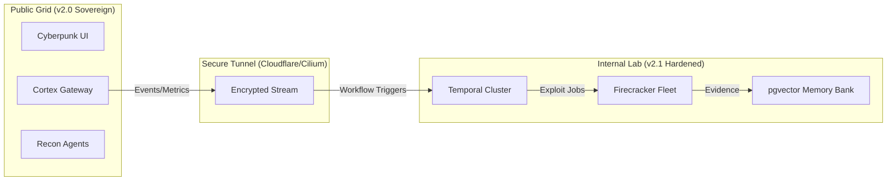

# 🌉 OMEGA BLACK: Sovereign Bridge Integration (v2.1)

> **Protocol Status:** ACTIVE  
> **Encryption:** AES-256-GCM + JWT  
> **Topology:** Hub-and-Spoke (Lab Hub -> Public Spokes)

## Overview

The **Sovereign Bridge** connects the public-facing "Discovery Grid" (this repository) with your internal **v2.1 Hardened Lab**. This allows you to perform distributed reconnaissance on the public internet while keeping your heavy exploitation infrastructure (Firecracker microVMs, Temporal Workers, Vector Memory) securely air-gapped or behind private VPNs.

### Topology



---

## 🛡️ Process Security Contract

**CRITICAL:** To maintain the integrity of the bridge, strictly adhere to the **`execFile` Only** contract.

### Why `exec` is Banned
Using `child_process.exec()` spawns a shell (`/bin/sh`), introducing vector for command injection via shell metacharacters (`;`, `|`, `&&`).

### The Standard: `execFile`
All bridge wrappers and recon tools MUST use `child_process.execFile()`. This executes the binary directly without a shell, treating arguments as literals.

**❌ Bad (Vulnerable):**
```javascript
exec(`subfinder -d ${domain}`, (err, stdout) => { ... });
```

**✅ Good (Hardened):**
```javascript
execFile('subfinder', ['-d', domain], (err, stdout) => { ... });
```

The pre-push hook (`.githooks/pre-push`) will accept only `execFile` patterns.

---

## 📘 Bridge Runbook

Follow these steps to establish the uplink between your public scaffold and private lab.

### 1. Configure the Bridge Environment
Create a `.env.bridge` file in the root directory (do not commit this file):

```bash
# .env.bridge
JWT_SECRET=your_synced_secret_key_from_lab
INTERNAL_LAB_URL=wss://lab.your-domain.internal
TEMPORAL_ADDRESS=lab-temporal.local:7233
CLOUDFLARE_TUNNEL_TOKEN=eyJhIjoi...
BRIDGE_MODE=true
```

### 2. Activate the Bridge Stack
Use the bridge-specific compose file to spin up the gateway and sync agents.

```bash
# Spin up the bridge services
docker-compose -f docker-compose.bridge.yml up -d

# Check connection status
docker logs -f omega-bridge-gateway
```

### 3. Verify Uplink
Run the verification signal to ensure the public gateway can reach the internal Temporal cluster.

```bash
# Send a test signal
curl -X POST http://localhost:5001/api/bridge/verify \
  -H "Authorization: Bearer $YOUR_JWT" \
  -H "Content-Type: application/json" \
  -d '{"signal": "SYN", "node": "public-01"}'
```

**Expected Output:**
```json
{
  "status": "ACK",
  "latency": "14ms",
  "lab_version": "v2.1-hardened"
}
```

### 4. Sync Vector Intelligence
Manually trigger an embedding sync if the automatic agent is delayed.

```bash
docker exec -it omega-vector-sync sh -c "/bin/sync_memory.sh --force"
```

---

## 🧩 Workflow Definitions

### Agent-to-Cortex Flow
1.  **Discovery**: Public `ReconService` identifies a new target (e.g., `api.target.com`).
2.  **Submit**: Target metadata is pushed to `CortexGateway`.
3.  **Tunnel**: Metadata is encrypted and streamed to the Internal Lab request queue.
4.  **Enrichment**: Internal Lab queries `pgvector` for historical patterns matching the target's technology stack.
5.  **Action**: Temporal workflow triggers a Firecracker microVM to probe for specific vulnerabilities (safe/sandboxed).
6.  **Recall**: Results are sanitized and sent back to the Public UI for display.

---

**Generated by OMEGA BLACK Ops** | v2.1 Hardened Integration
