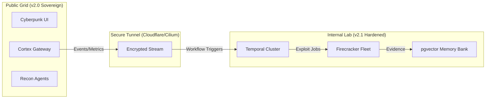
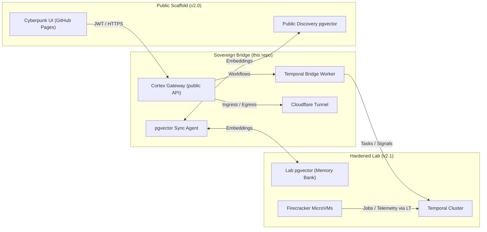

# 🌉 OMEGA BLACK: Sovereign Bridge Integration (v2.1)

> **Protocol Status:** ACTIVE  
> **Encryption:** AES-256-GCM + JWT  
> **Topology:** Hub-and-Spoke (Lab Hub -> Public Spokes)

## Overview

The **Sovereign Bridge** connects the public-facing "Discovery Grid" (this repository) with your internal **v2.1 Hardened Lab**. This allows you to perform distributed reconnaissance on the public internet while keeping your heavy exploitation infrastructure (Firecracker microVMs, Temporal Workers, Vector Memory) securely air-gapped or behind private VPNs.

### Topology



---

## 🛡️ Process Security Contract

**CRITICAL:** To maintain the integrity of the bridge, strictly adhere to the **`execFile` Only** contract.

### Why `exec` is Banned
Using `child_process.exec()` spawns a shell (`/bin/sh`), introducing vector for command injection via shell metacharacters (`;`, `|`, `&&`).

### The Standard: `execFile`
All bridge wrappers and recon tools MUST use `child_process.execFile()`. This executes the binary directly without a shell, treating arguments as literals.

**❌ Bad (Vulnerable):**
```javascript
exec(`subfinder -d ${domain}`, (err, stdout) => { ... });
```

**✅ Good (Hardened):**
```javascript
execFile('subfinder', ['-d', domain], (err, stdout) => { ... });
```

The pre-push hook (`.githooks/pre-push`) will accept only `execFile` patterns.

---

## 🧬 Sovereign Bridge Runbook

This section turns the narrative into a concrete, reproducible bridge between:

- **v2.1 Hardened Lab** (Firecracker, Temporal, Memory Bank / pgvector)
- **v2.0 Sovereign Public Scaffold** (Gateway + Cyberpunk UI)

The goal: let your **Agents** (lab micro‑VMs and workers) talk to the **Cortex** (public gateway)
without exposing your lab network to the internet.

---

### 1. Topology: Agent → Cortex → Memory Bank



---

### 2. Prerequisites

1. **Lab side**
   - Temporal cluster reachable from the Bridge (VPN, WireGuard, or private link).
   - pgvector‑enabled Postgres for the **Memory Bank**.
   - Optional: Firecracker microVM orchestration wired to Temporal workflows.

2. **Public side**
   - The **Sovereign Scaffold** deployed (Node.js/Express API + Cyberpunk UI).
   - Public pgvector instance for the **Discovery index**.

3. **Bridge host**
   - A Linux node that can reach **both**:
     - Lab Temporal + Postgres
     - Public pgvector (and optionally the public API)
   - Docker + docker‑compose installed.
   - Cloudflare account and a configured **Tunnel** token.

---

### 3. Configure the Bridge

From the repo root:

```bash
cp .env.bridge.example .env.bridge  # use the provided template
nano .env.bridge
```

 - **JWT**: `JWT_SECRET`, `JWT_ISSUER`, `JWT_AUDIENCE` must match the values used by:
    - The public API gateway
    - The Cyberpunk UI
- **Temporal**: `LAB_TEMPORAL_HOST`, `TEMPORAL_NAMESPACE`, `TEMPORAL_TASK_QUEUE` define the queue used by bridge workers
- **Memory Bank**: `LAB_PGVECTOR_URL` → internal “Memory Bank” / `PUBLIC_PGVECTOR_URL` → public Discovery index
- **Sync**: `SYNC_DIRECTION`:
    - `lab-to-public` (recommended): lab is source of truth
    - `bidirectional`: if you implement conflict resolution
- **Tunnel**: `TUNNEL_TOKEN`, `TUNNEL_PUBLIC_HOST` configure the Cloudflare Tunnel
  - `TUNNEL_PUBLIC_HOST` is the hostname your UI will call for the gateway

---

### 4. Launch the Sovereign Bridge

To start the bridge stack:

```bash
# From the repo root
docker-compose -f docker-compose.bridge.yml pull
docker-compose -f docker-compose.bridge.yml up -d
```

Verify:

```bash
docker-compose -f docker-compose.bridge.yml ps
docker logs -f omega-temporal-bridge-worker
docker logs -f omega-pgvector-sync
docker logs -f omega-bridge-tunnel
```

Success means:
- `cortex-gateway` listening on `0.0.0.0:8080`
- `temporal-bridge-worker` connected to your lab Temporal namespace
- `pgvector-sync` reporting successful sync cycles
- `cloudflared` exposing the gateway at `https://$TUNNEL_PUBLIC_HOST`

---

### 5. Wiring the Cyberpunk UI

Point the UI to the **Bridge Gateway**:

- In your frontend `.env.production` (or equivalent):

```env
VITE_API_BASE_URL=https://YOUR_BRIDGE_HOSTNAME/api
VITE_JWT_ISSUER=omega-black-sovereign
VITE_JWT_AUDIENCE=omega-black-clients
```

Rebuild and redeploy the UI so that:

- All authenticated calls go to the **Bridge Cortex Gateway**
- JWTs are validated using the same `JWT_SECRET` / issuer / audience as the bridge

---

### 6. Operations

- **Cold start**
  - `docker-compose -f docker-compose.bridge.yml up -d`
- **Rolling update**
  - `docker-compose -f docker-compose.bridge.yml pull`
  - `docker-compose -f docker-compose.bridge.yml up -d`
- **Pause the bridge (maintenance)**
  - `docker-compose -f docker-compose.bridge.yml stop`
- **Emergency kill switch**
  - `docker-compose -f docker-compose.bridge.yml down`

When the **Bridge** is up:

- The public UI becomes a **secure remote cockpit** for your lab.
- All heavy lifting (scans, execution, long‑running workflows) stays inside the Hardened Lab.
- Only vetted JWT traffic traverses the Tunnel.

This is the “Sovereign Bridge”: the public face speaks in the same language as the lab cortex,
without ever handing the internet a direct line into your microVM swarm.
