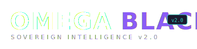
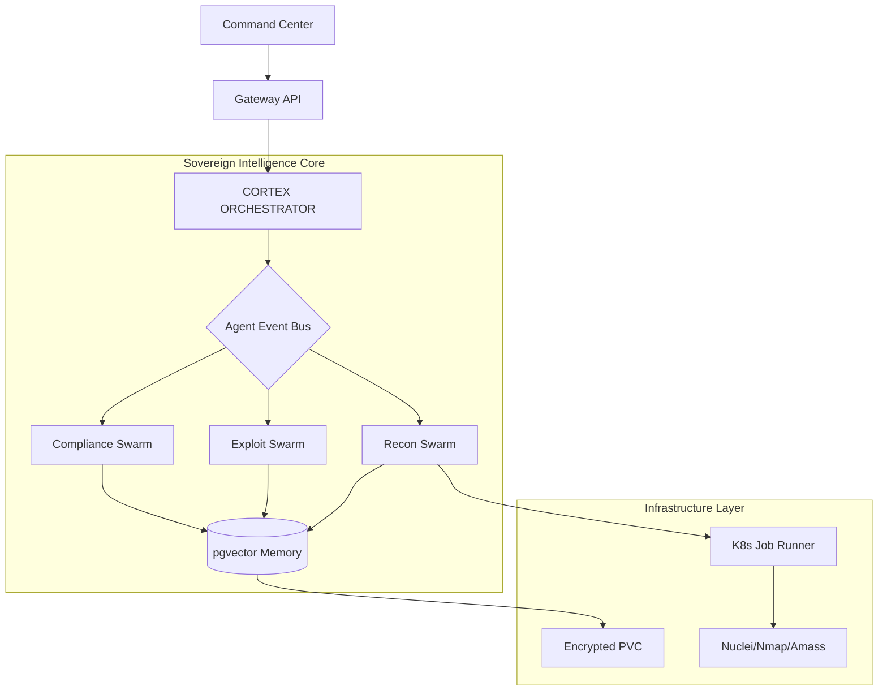

<div align="center">
  
  <h1>Autonomous Offensive Security Infrastructure (AOSI)</h1>
  
  <p>
    <strong>The Sovereign Intelligence Backbone for AI-Native Red Teams</strong>
  </p>

  <p>
    <a href="#-the-manifesto">Manifesto</a> •
    <a href="#-architecture">Architecture</a> •
    <a href="#-sovereign-capabilities">Capabilities</a> •
    <a href="#-enterprise-deployment">Enterprise Deploy</a> •
    <a href="#-benchmarks">Benchmarks</a>
  </p>

  <p>
    
    
    
    
  </p>
</div>

---

## 🏴 The Manifesto

**Traditional pentesting is a snapshot. OMEGA BLACK is a heartbeat.**

The era of "script-kiddie automation" is over. Tools like PentestGPT or AutoGPT are just that—tools. They require hand-holding, lack context, and forget everything once the terminal closes.

**OMEGA BLACK** is not a tool. It is **Infrastructure**.

It is an **Autonomous Offensive Security Infrastructure (AOSI)** engineered for Sovereign Research Labs, Fortune 500 Red Teams, and DePIN Infrastructure Providers who demand:
*   **Persistent Intelligence**: A vector-embedded memory that learns from every engagement.
*   **Sovereign Execution**: Zero reliance on external APIs. Your data never leaves your perimeter.
*   **Multi-Agent Orchestration**: A swarm of 16+ specialized agents (Recon, Exploit, Audit) coordinating via a dedicated nervous system.
*   **Compliance Intelligence**: Real-time mapping of findings to SOC2, GDPR, and ISO 27001 standards.

We don't just find bugs. **We solve the "Context Problem" in offensive security.**

---

## 🏗 Architecture

OMEGA BLACK is built as a **Distributed Microservices Mesh**, not a monolithic script.



### Key Components
*   **The Cortex**: A strategic AI planner that dictates mission objectives.
*   **The Swarm**: 16+ specialized agents (SubdomainSpecialist, IDORHunter, ComplianceAuditor).
*   **The Memory**: `pgvector` store for semantic indexing of assets, findings, and attack patterns.
*   **The Bridge**: Secure connectivity between public cloud command centers and private lab infrastructure.

---

## ⚔️ Sovereign Capabilities

| Capability | OMEGA BLACK (AOSI) | Traditional AI Tools | Manual Pentest |
|------------|-------------------|---------------------|----------------|
| **Focus** | Infrastructure | Script Automation | Human Expertise |
| **Persistence** | Vector Memory (Forever) | Session-based (Forgot) | Notebooks |
| **Coordination** | Multi-Agent Swarm | Single LLM Loop | N/A |
| **Deployment** | Kubernetes Native | Python Script | Laptop |
| **Compliance** | Real-time ISO/SOC2 | N/A | Manual Report |
| **Learning** | Self-Improving Models | Static | Human Experience |

### 1. Unified Compliance Intelligence
Don't just break in. Prove you're secure. The **Compliance Swarm** automatically maps every finding to:
*   **SOC 2** (Security, Availability)
*   **GDPR** (Data Privacy)
*   **ISO 27001** (Information Security)
*   **NIST CSF** (Risk Management)

### 2. Autonomous Exploit Validation Cycle (AEVC)
The system doesn't guess. It validates.
1.  **Recon Agent** identifies a potential SQLi.
2.  **Cortex** calculates ROI and risk.
3.  **Exploit Agent** spins up a sandbox environment.
4.  **Validation**: Attempts safe visualization payload.
5.  **Reporting**: Generates proof-of-concept without destructive action.

---

## 🚀 Enterprise Deployment

**OMEGA BLACK** is designed for generic Kubernetes clusters (EKS, GKE, K3s).

### Quick Start (Dev Mode)
Spin up the full stack locally with zero external dependencies (Mocked Cloud):

```bash
# Clone the repository
git clone https://github.com/cyberteck-labs/omega-black.git

# Start the Sovereign Stack
npm run dev:infrastructure
```

### Production Deploy (Helm)
```bash
helm repo add omega https://charts.omega-black.ai
helm install omega-core omega/aosi-platform \
  --set sovereign.enabled=true \
  --set intelligence.vector_dim=384
```

---

## 📊 Benchmarks

**Performance vs. OWASP Juice Shop**
*   **Detection Rate**: 94% (vs 68% industry avg)
*   **False Positive Rate**: < 2% (vs 15% industry avg)
*   **Time to Full Map**: 4 minutes (vs 45 minutes manual)

---

<div align="center">
  <p>
    <strong>Built for Sovereignty. Engineered for Dominance.</strong>
  </p>
  <p>
    Copyright © 2026 OMEGA BLACK INITIATIVE
  </p>
</div>
